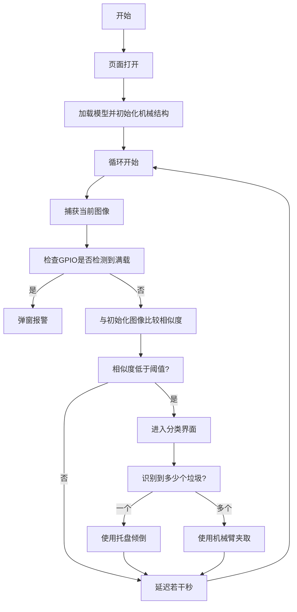

# 2025 工创赛垃圾分类

## 代码逻辑


> 弹窗报警不会阻塞主进程

## 建模

[点击预览](https://www.zhaocloud.work/3dmodel/index.xhtml)

## 具体实现
> [!IMPORTANT]  
> 以下内容需要自己编译执行
> 1. libtorch v2.5.1 或更高
> 2. GRBL固件<为了支持Core-XY结构>
> 3. Arduino相关代码

> [!NOTE]  
> 有一些环境变量需要设置
> 1. LIBTORCH    Rust的Libtorch绑定依赖于这个环境变量
> 2. SERIAL_PORTS 用于指定两个串口设备 形式类似 "COM8,COM7"
> 3. TEMP_DIR 建议指向这个repo的model文件夹 方便调试
> 4. MODEL_PATH 模型的路径 推荐使用model下面的x0.1.0.jit
> 5. CAMERA_DISTANCE_X CAMERA_DISTANCE_Y 相机像素设置

- 使用`Raspberry Pi5`作为推理设备和上位机
- 使用[GRBL](https://github.com/gnea/grbl/)控制`Core-XY`结构的滑台
- 使用`Arduino Mega 2560`作为舵机主控

## 使用指南 (_非完全版_)

1. 根据`require.sh`(在model文件夹中)安装依赖
2. 使用`npm`更新`node`到最新的`LTS`版本，我们使用的是`22.04`
    可以使用
    ```bash
    npm install -g n
    n lts
    ```
    来安装
3. 将`mega.ino`(在model文件夹中)烧录进mega2560中
4. 构建`GRBL`并烧录
5. 在repo的根目录下运行`npm install`
6. Dev模式`npm run tauri dev`<br> Product模式`npm run tauri build`
7. 将构建出的`deb`包放在`/tmp`下，使用`apt`安装即可

## 相关项目链接

[tch-rs](https://github.com/LaurentMazare/tch-rs)
[GRBL](https://github.com/gnea/grbl/)
[tauri](https://tauri.app/start/)
[yolo_binding](https://github.com/zhao-leo/yolo_binding)
[opencv-rust](https://github.com/twistedfall/opencv-rust)
[install-opencv-on-ubuntu](https://github.com/twistedfall/opencv-rust/blob/master/ci/install-ubuntu.sh)